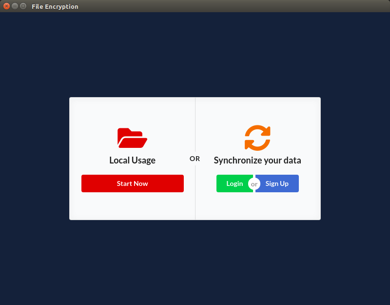
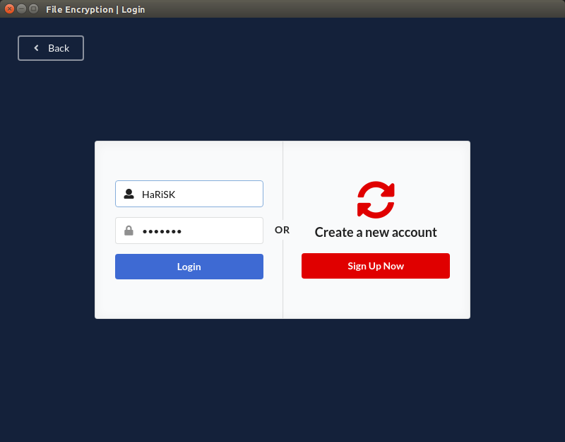
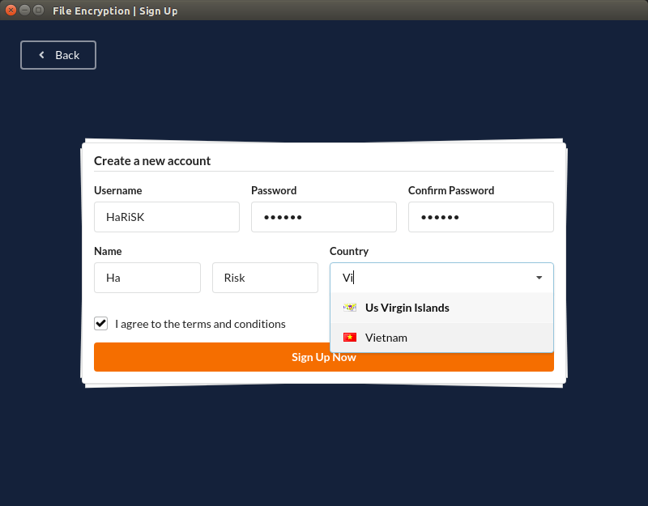
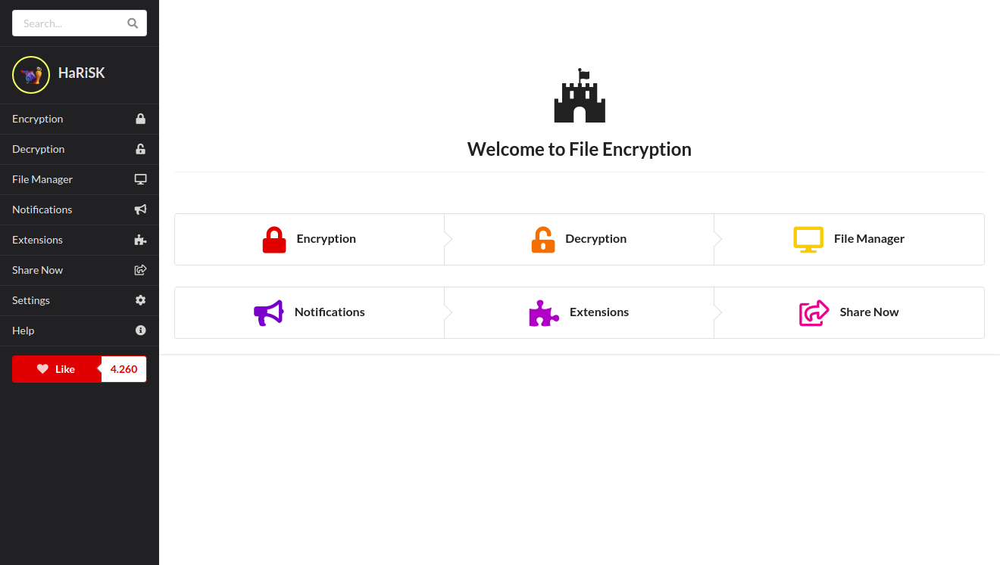
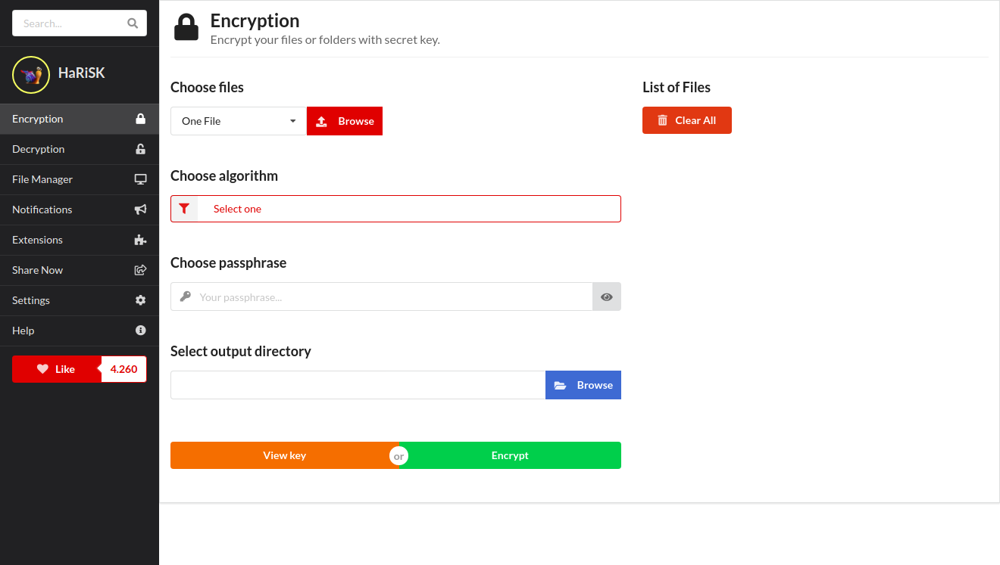
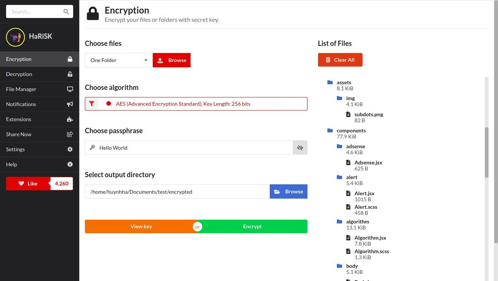
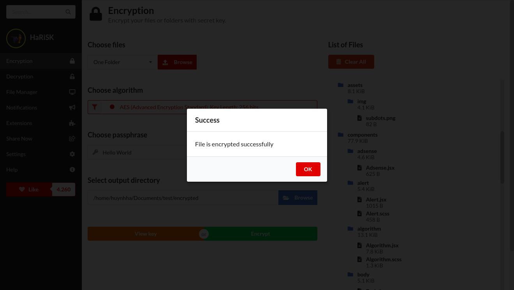
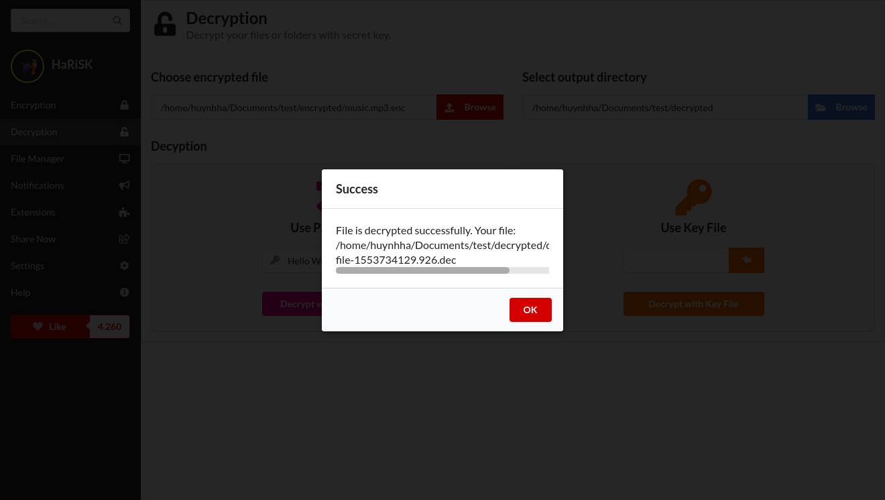
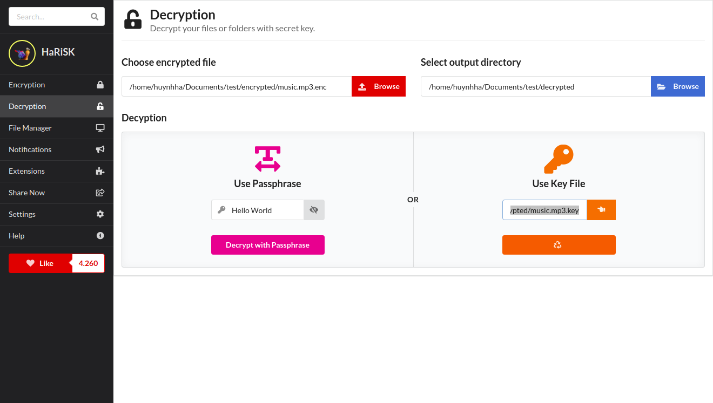
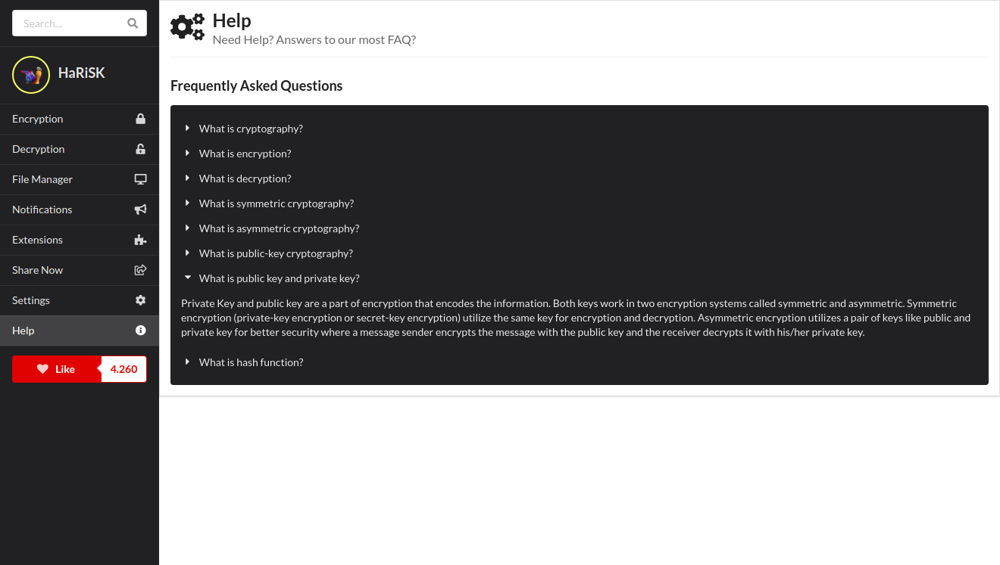

# electron-file-encryption

## Quickstart

```
npm install
npm start
```

## Semantic UI Style
Ref: https://semantic-ui.com/elements/button.html

## Build
```
npm run build
```

## Screenshots












